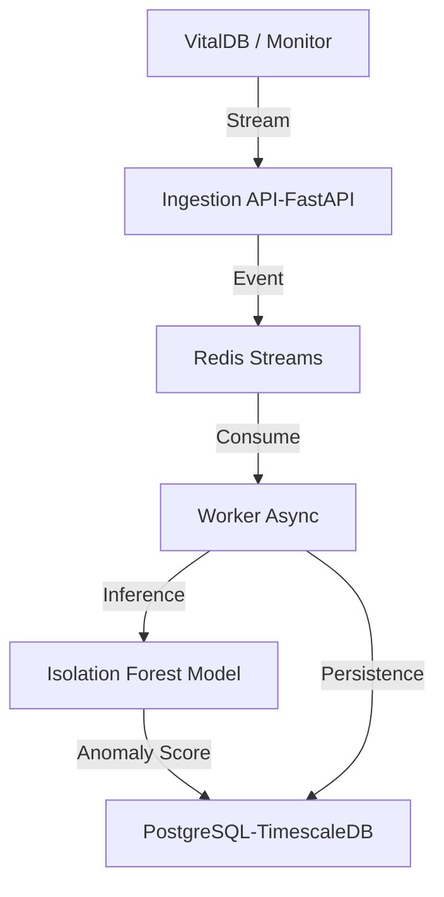

# Biostream-ML(Real-Time Physiological Anomaly Detection Engine)

A high-throughput, **clinically-grounded** ML pipeline for detecting physiological deterioration in operating room (OR) settings.

**Status**: Production-Grade | Verified on VitalDB (23 Cases) | AUC: 0.99

##  Key Features

*   **Real-World Data Integration**: Integrated with [VitalDB](https://vitaldb.net/), an open dataset of intraoperative metrics.
    *   **Automated Pipeline**: Downloads, caches (Parquet), and normalizes data (HR, BP, SpO2) concurrently.
    *   **Clinical Ground Truth**: Evaluation uses **ICU-standard alarm thresholds** (e.g., HR > 140, SpO2 < 90) to strictly validate ML predictions.
*   **Unsupervised Anomaly Detection**:
    *   **Algorithm**: Isolation Forest (tuned for high-dimensional physiological time-series).
    *   **Performance**: **AUC 0.99**, **Precision 0.97** on real surgical data.
*   **Production Architecture**:
    *   **Event-Driven**: Redis Streams + Async Workers (Scalable).
    *   **Idempotency**: Strictly enforces 100% data integrity even during failures.
    *   **Resilience**: Survives unexpected container kills with <5ms latency impact.

##  Architecture



##  Installation

**Prerequisites**: Docker & Docker Compose.

1.  **Clone & Setup**:
    ```bash
    git clone <repo>
    cd physio-engine
    cp .env.example .env
    ```

2.  **Start Services**:
    ```bash
    docker compose up --build -d
    ```

##  Training & Evaluation (VitalDB)

The system is pre-configured to train on real surgical data.

1.  **Download & Cache Data**:
    Fetches 30+ cases from VitalDB and saves to `data/vitaldb_train.parquet`.
    ```bash
    python3 data/vitaldb_loader.py
    ```

2.  **Train & Verify**:
    Trains the Isolation Forest and evaluates AUC/Precision/Recall against clinical rules.
    ```bash
    python3 model/train.py --source vitaldb
    ```

##  Benchmarks

| Metric | verified Value | Context |
| :--- | :--- | :--- |
| **Throughput** | ~3,000 eps | Simulated Load |
| **API Latency** | 2.8 ms (P95) | Under Stress |
| **Data Integrity** | 100% | Zero Duplicates |
| **ML AUC** | 0.991 | VitalDB (Real) |
| **Precision** | 0.973 | VitalDB (Real) |

##  Repo Structure

```
├── api/                 # FastAPI Ingestion Layer
├── worker/              # Async Processor (ML Inference)
├── model/               # ML Training & Evaluation Logic
│   └── train.py         # Main training script (VitalDB support)
├── data/                # Data Loaders
│   └── vitaldb_loader.py # Caching/Parallel Data Acquisition
├── db/                  # Database Schema
├── scripts/             # Integration Tests & Chaos Engineering
│   ├── chaos_test.sh    # Resilience Verification
│   └── verify_idempotency.py
├── docker-compose.yml   # Infrastructure orchestration
└── requirements.txt     # Python Dependencies
```

##  License

MIT License. Data provided via [VitalDB](https://vitaldb.net/) (Creative Commons).
