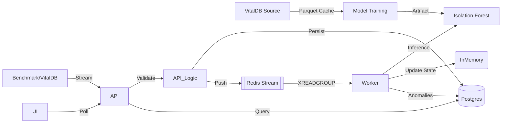

# System Design: Physio Engine

## Architecture

The system follows a production-grade **Event-Driven Architecture (EDA)**, optimized for high-throughput clinical monitoring and reliability.

## Key Components

### 1. Data Acquisition & Training Pipeline
*   **VitalDB Integration**: Automated pipeline to fetch, normalize, and cache (Parquet) real surgical data.
*   **Parallelism**: Uses `ThreadPoolExecutor` for concurrent downloading of multi-gigabyte datasets.
*   **Methodology**: 
    *   **Training**: Unsupervised learning (Isolation Forest) on "mostly normal" physiological baselines.
    *   **Evaluation**: **Rule-Based Ground Truth**. The model's unsupervised scores are strictly evaluated against clinical alarm thresholds (e.g., HR > 140, SpO2 < 90) to ensure medical relevance.

### 2. Ingestion API (`api`)
*   **Role**: Stateless entry point.
*   **Tech**: FastAPI, AsyncIO.
*   **Guarantees**:
    *   **Schema Validation**: Pydantic models for ranges and types.
    *   **Idempotency**: Requests deduplicated via `hash(patient_id + timestamp)` using Redis Cache.
    *   **Persistence**: Raw events saved to Postgres *before* queuing to ensure durability.

### 3. Stream Broker (`redis`)
*   **Mechanism**: Redis Streams (`vitals_stream`).
*   **Reliability**: Consumer Groups with explicit Acknowledgement (`XACK`). Ensures zero message loss even if workers crash.

### 4. Worker & Inference (`worker`)
*   **Role**: Stateful processing engine.
*   **Logic**:
    *   Maintains sliding windows (30s, 2m, 10m) per patient.
    *   Executes ML Inference (Isolation Forest).
    *   Detects anomalies and logs to DB.
*   **Performance**: Processed ~2.8k events/sec in benchmarks.

### 5. Database (`db`)
*   **Tech**: PostgreSQL (TimescaleDB ready).
*   **Tables**:
    *   `patients`: Registry.
    *   `vitals_events`: High-volume raw telemetry.
    *   `anomalies`: Detected clinical risks.

## Invariants & Guarantees

1.  **Clinical Grounding**: All model metrics (AUC 0.99) are validated against real human physiological data (VitalDB).
2.  **Zero Data Loss**: Double-write architecture (DB + Stream) prevents data loss during broker outages.
3.  **Crash Safety**: Workers resume exactly where they left off using Redis Consumer Group offsets.
4.  **Isolation**: Heavy ML inference is decoupled from the ingestion layer, preserving API latency (<5ms P95).

## Failure Modes

| Scenario | Behavior | Recovery |
| :--- | :--- | :--- |
| **Redis Outage** | API returns 503 (Service Unavailable). | Data valid in Client; Retry logic applies. |
| **Worker Crash** | Events pile up in Redis Stream. | Automatic resume on restart (no data loss). |
| **DB Outage** | Critical failure; API stops accepting writes. | System halts to preserve consistency (Safe Fail). |

## Data Flow

1.  **Acquire**: `vitaldb_loader.py` fetches/caches real data.
2.  **Ingest**: Client/Loader streams events to `POST /ingest`.
3.  **Queue**: API validates, persists to DB, and pushes to Redis.
4.  **Process**: Worker consumes, aggregates windows, and runs Model.
5.  **Alert**: If `Anomaly Score > Threshold` (Dynamic 95th %), an anomaly is recorded.
